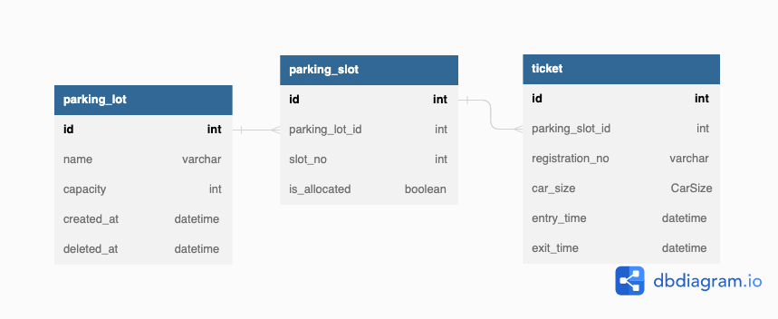

## APIs

1) It should provide us with api to create parking lot
- POST - /parking-lots
2) It should provide us with api to park the car
- POST - /parking-lots/:parkingLotId/tickets
3) It should provide us with api to leave the slot
- DELETE - /parking-lots/:parkingLotId/tickets/:ticketId
4) It should provide us with api to get status of parking lot
- GET - /parking-lots/:parkingLotId
5) It should provide us with api to get registration plate number list by car size
- GET - /parking-lots/:parkingLotId/tickets?carSize=MEDIUM
6) It should provide us with api to get registration allocated slot number list by car size
- GET - /parking-lots/:parkingLotId/slots?carSize=MEDIUM

## Database Design



## Running the app

```bash
# development
$ docker-compose up --build -d
```

- The app would be running on port 3000.

## Unit Test

```bash
# unit tests
$ yarn run test

# e2e tests
$ yarn run test:e2e

# test coverage
$ yarn run test:cov
```

## Unit Test

```bash
# unit tests
$ yarn run test

# test coverage
$ yarn run test:cov
```

## E2E Test

Firstly, Run this script to init a database container for running e2e test.

```bash
$ yarn run e2e:up
```

To run e2e test. 
It might error if the database container is not initailzed completedly.
```bash
$ yarn run test:e2e
```

Once you are satisfied you can run yarn the below script to destroy the container.
```bash
$ yarn run e2e:down
```